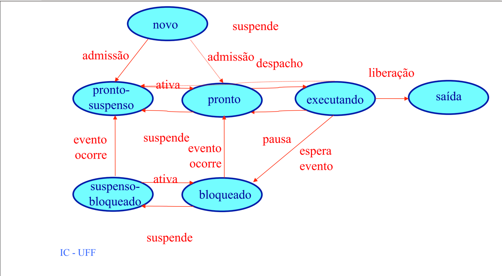

# Escalonador

Escalonador de processos desenvolvido para a disciplina de Sistemas Operacionais - Universidade Federal Fluminense

## Equipe De Desenvolvimento

* Gabriel Spievak
* João Pedro Conceição
* Jorge Guimarães
* Matheus Folly

## Como Executar

Executar o arquivo sistema_operacional.py.


```bash
# Linux
python3 sistema_operacional.py

# Windows
py.exe sistema_operacional.py
 ```

O programa aguarda um Enter entre as iterações para facilitar a leitura da tela.

## Classes E Arquivos

### ```sistema_operacional.py```

Programa principal, controla o fluxo de criação de objetos e coordena a chamada de métodos de controle.

### ```entrada```

Arquivo de texto estruturado contendo os processos a serem executados. Podem estar desordenados em função da chegada.

> _Nota:_
>
> As linhas com "#" são comentários, e não serão executadas.

### ```Escalonador```

Responsável por coordenar os estados dos processos, quando são instanciados ou liberados, e seus fluxos conforme o diagrama de sete estados.


_Diagrama de sete estados_*

### ```Recursos```

Faz a gestão de recursos do sistema simulado: Processadores, Discos e memória principal. Entre suas atribuições está a verificação de recursos disponíveis, solicitação de alocação, liberação e impressão simplificada de recursos utilizados.

### ```Processador```

Recurso que executa ou libera a execução de um processo. Será disponibilizado a um processo por vez. Processos podem ganhar ou perder processador de acordo com a fila de processos e a política de escalonamento. 

### ```Disco```

Unidade de leitura/ escrita. Será disponibilizada a um processo por vez, porém um processo pode solicitar mais de um disco, e sua reserva de uso dependerá da disponibilidade no momento da solicitação.

### ```Processo```

Imagem do programa a ser executado. Tem noção própria de quando terminar, se necessita de recursos (e quantos) e se é de tempo real ou de usuário.

### ```EstadoProcesso```

Auxilia na gestão de estado de um processo. Em seu método ```neste()``` dá-se a mudança de estado. Sua chamada visa uma mudança clara no estado do processo:

```python
# No escalonador ...
executar_bloqueio = EstadoProcesso(
                                atual=self.lista_executando,
                                proximo=self.lista_bloqueados,
                                estado=estado['bloqueado'],
                                msg_padrao='Estava executando mas precisa ler/gravar. Foi bloqueado a espera de ocorrer evento')

processo = Processo(id_processo=1, chegada=5, prioridade=1, duracao=4, memoria=128, discos=3)

# bloqeuar um processso
executar_bloqueio.neste(processo)
```

## Nota Ao Orientador

No último commit a exibição da memória usada passou a falhar, mostrando as vezes números negativos. Pode ser visto no arquivo de saída.

## Gostei, Posso Usar Ou Copiar?

Pode. Pode copiar, mudar o código e até vender, desde que distribua sob a mesma licença, MIT (ver arquivo LICENSE).

Não custa nada dar o crédito aos desenvolvedores :) 
Se gostou comunique-nos.

> \* A imagem do diagrama pertence a Profa. Cristina Boeres - Universidade Federal Fluminense

## Acho Quer Posso Fazer Melhor?

Ótimo. Sugestões, críticas, issues e pull requests serão bem recebidos.
Há alguns #TODOs nos arquivos. Este é um bom ponto por onde começar.

## Histórico

+ Apresentado em 2021-09-18;